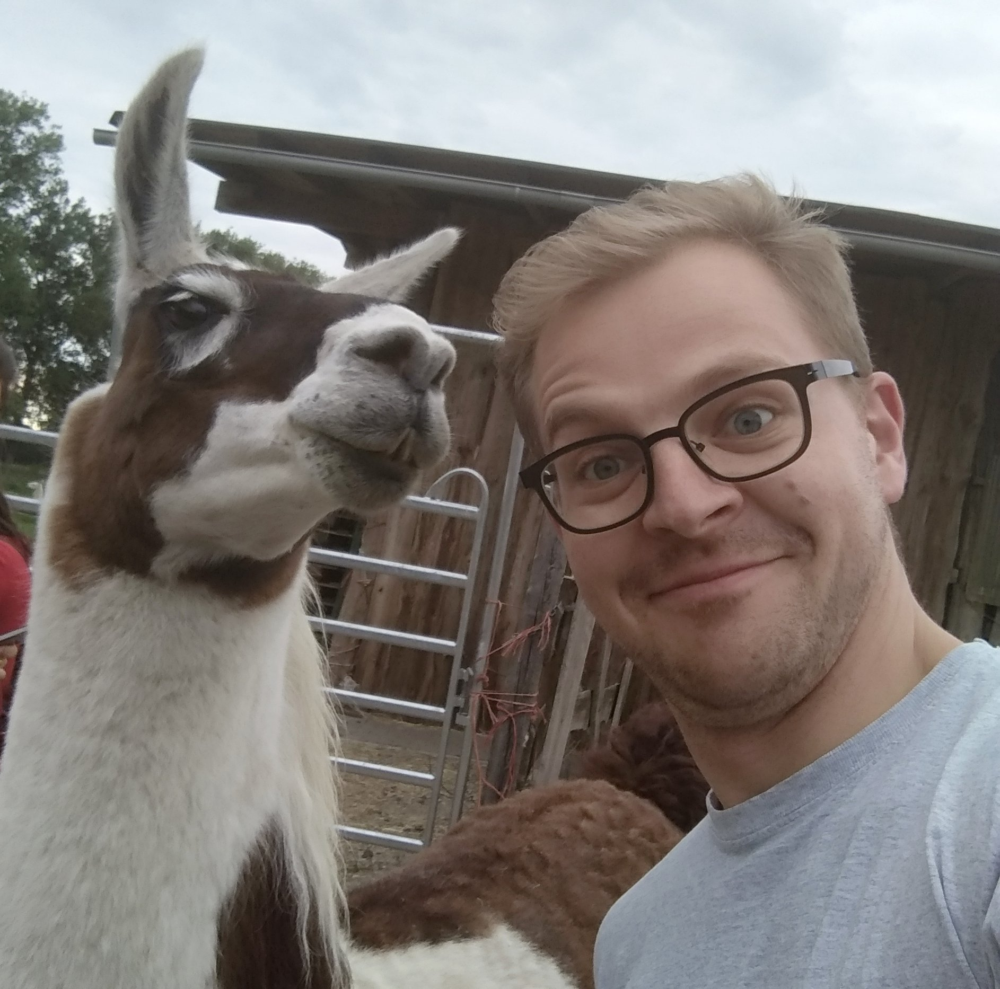

### What is this?
Hi, and welcome to my blog. My name is Elias and I'm a computer engineering student from Berlin. I've learned *a lot* from other people's blog posts on the internet in the past. I figured I'd do the same and write some of the documentation, tutorials and walk-throughs I wish I had on issues that I had to figure out myself. That's what this blog is for: Keeping track of what I do, how I do it and ideally be of help to someone who's struggling with the same things that I struggled with on some of
my projects.

### The _Me_ section
No personal blog would be complete without me introducing myself, so here we go: I live in Berlin and am about to finish my degree in Computer Engineering. I'm interested in many aspects of technology, but particularly in electronics, PCB design and microcontroller programming. Apart from that, I like playing around with CUDA and some basic machine learning techniques.

Also, here's a selfie of me with a llama:

