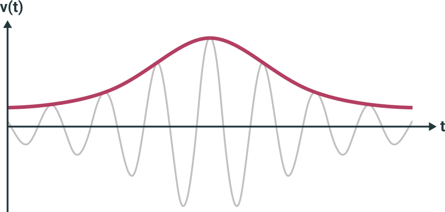

+++
title = "Ultrasonic Distance Sensor from Scratch - Receiver"
+++
Theoretical foundations for dimensioning and building an analog amplifier circuit around a 40kHz ultrasonic receiver
<!-- more -->

While there are cheap, ready-made ultrasonic distance measuring sensors with good support like the ubiquitous [HC-SR04](https://cdn.sparkfun.com/datasheets/Sensors/Proximity/HCSR04.pdf), I needed to roll my own for a project. I needed precise access to the timing of the impulse and the adc signal. The HC-SR04 does not handle this use case too well, because it has an integrated MCU that does most of these things internally. The HC-SR04 also only runs on 5V, which is inconvenient for projects that only use 3.3V otherwise. I also wanted to run the analog ouput signal into the MCU's ADC directly. Mainly because I wanted to play around with a few different algorithms to increase the robustness of the object detection and because I was hoping to increase the accuracy by having the resolution of an ADC running at 1MHz and with DMA attached to it. The HC-SR04 only uses a simple thresholding which can only detect a single peak. I bought a handful of [Murata MA40S](https://www.murata.com/~/media/webrenewal/products/sensor/ultrasonic/open/datasheet_maopn.ashx?la=en) transducers and receivers a while back and thought that it would make for an interesting project to build a circuit around them.

## 1. Introduction

I had trouble finding a well-documented design online, so I decided that I would make this a multi-part series on how to build a sender and receiver circuit from scratch. I'll lay out each part of the process and provide some background as well as the necessary schematics.

The general idea of measuring things with ultrasound is: Send an impulse at a frequency so high that it is not audible to the human ear. The impulse will be bounced off the nearest object and return. Since it travels relatively slow, compared to the speed of an MCU, we can measure the time it takes to return and use that to calculate the distance to the reflecting object.
If you're not familiar with the concept of ultrasonic distance measuring, check out [this excellent tutorial](https://lastminuteengineers.com/arduino-sr04-ultrasonic-sensor-tutorial/) first! It'll walk you through how to measure distances with ultrasound. Some basic knowledge will certainly make following along a lot easier.

## 2. Receiver Theory

The receiver circuit is probably the most complicated part of the project. It deals with analog signals and needs to amplify the important parts of an input signal. For the most part, I replicated the [HC-SR04 receiver circuit](http://www.pcserviceselectronics.co.uk/arduino/Ultrasonic/electronics.php#circuit). It consists of four parts:

1. Inverting High-Pass Amplifier
2. Band-Pass Amplifier
3. Inverting High-Pass Amplifier
4. Comparator/Thresholding Circuit

For my design, I've more or less copied the first three stages, but replaced the last one with an envelope detection, the output of which gets fed into an ADC.

Let's go over what each stage does in more detail:

### 2.1. Stage 1: Inverting High Pass Amplifier

Here's a schematic of what the first stage looks like:

now let's go over what it does in detail. It's first order high pass, meaning that it attenuates lower frequencies while letting higher frequencies pass. First order comes from the fact that there is only one element in there that influences the frequency response, namely the capacitor. In the original circuit, the value of **R1** is 47k. I've increased this to be 75k, just like in Stage 3 to get a bit more amplification. Now let's do some math to find out how the circuit behaves: 


\begin{aligned}
A_v &= -\frac{R_2}{R_1}\\
	&= -\frac{75k\Omega}{10k\Omega}\\
	&= -75\\[1.5em]
f_C &= \frac{1}{2 \pi \cdot R_1 \cdot C}\\
	&= \frac{1}{2 \pi \cdot 10k\Omega \cdot 10nF}\\
    &= 1592 \text{ kHz}
\end{aligned}


So we're getting 7.5 times the input signal with a 3db attenuation at 1592 kHz. The fact that the input signal is inverted doesn't really matter to us, since we will detect the envelope later one anyway.

### 2.2. Stage 2: Bandpass

The second stage is quite a bit more complicated. While first order amplifiers can only amplify high **or** low frequencies, a bandpass needs more parts, but can amplify frequencies *around* a specific center frequency and attenuate everything else that's further away. We will use a rather clever circuit known as a [Multiple Feedback Band-Pass Filter](http://www.ecircuitcenter.com/Circuits/MFB_bandpass/MFB_bandpass.htm) for this. It looks like this:

It's helps to pick **C1 = C2** so that the calculations are a bit easier. Here are the filter characteristics:


\begin{aligned}
R_{1,2} &= R_1 || R_2\\
		&= 194 \Omega\\
f_0 	&= \frac{1}{2 \pi \cdot C \sqrt{R_{1,2} \cdot R_3}}\\
		&= \frac{1}{2 \pi \cdot 1nF \cdot \sqrt{ 194 \Omega \cdot 75k\Omega}}\\
		&= 41.7 \text{kHz}\\[1.5em]
BW 		&= \frac{2}{R_3 \cdot C}\\
		&= \frac{2}{75k\Omega \cdot 1nF}\\
        &= 26.7 \text{kHz}\\[1.5em]
Q 		&= \frac{1}{2} \sqrt{\frac{R_3}{R_{1,2}}}\\
		&= \frac{1}{2} \sqrt{\frac{75k\Omega}{194 \Omega}}\\
		&= 9.8
\end{aligned}


This means that the filter is (roughly) centered around the carrier frequency of 40kHz and will attenuate frequencies that are 26.7kHz above and below that with 3dB. The Q factor tells us how steep the attenuation curve is.

### 2.3. Stage 3: Inverting amplifier

As mentioned above, this stage is the same as the first stage, which means that the characteristics will be identical.

### 2.4. Simulation

I don't have that much experience with analog design, so I recreated the circuit in [LTSpice](https://www.analog.com/en/design-center/design-tools-and-calculators/ltspice-simulator.html), an analog circuit simulation software that you can use for free. Before I designed everything into a board, I wanted to be sure that I hadn't made any really obvious mistakes in the receiver circuit.

with that in place, I simulated the frequency response of stages 1-3 for frequencies between 20kHz and 60kHz.

It shows that the circuit has the highest amplification around 40kHz and that the amplification factor drops off steeply to both sides. Yay! It seems that - at least in theory - our circuit works as expected!

### 2.5. Stage 4: Envelope detection

Out of our amplifier stages, we are getting a 40kHz signal in which some peaks are higher than others. We could do some magic in software to retrieve the distance information from those peaks. What we would want to have ideally would be a smooth signal that is flat when nothing is detected and with a spike for each reflection. This is where [Envelope Detection](https://en.wikipedia.org/wiki/Envelope_detector) is useful: It transforms our high-frequency signal with many peaks into its *envelope*. Here's an idealized drawing of an envelope detector on a modulated signal:

In this drawing, our detector can - somewhat magically - predict the future, because it conveniently rises to the next peak before it has even occurred. The output of a real one will probably look a bit more rough.

Here's the circuit of the envelope detection:

Let's go over what the individual parts do: The diode **D1** removes the bottom half wave, leaving only the upper half. Each peak charges **C1**. After each peak, C1 slowly discharges through **R1**. R1 needs to be small enough for the voltage of C1 to decay over time, yet large enough that it doesn't drop immediately. I've experimented with the values in LTSpice until I was happy with the behavior in the simulation. **C2** then removes the DC component of the signal, making sure that we don't have a constant offset in our envelope. 

Here's what happens when we simulate the circuit it in LTSpice:

...not quite the same as the ideal one above, but good enough! (Ignore the voltages on the y-axis. They don't mean anything since our input signal will be a few mV, not Volts, like I used in the simulation)

## 3. Summary

I hope a bit of theory helps in understanding what the different parts of the circuit are doing. When taking it apart, I find that it becomes a lot less daunting and magical.
