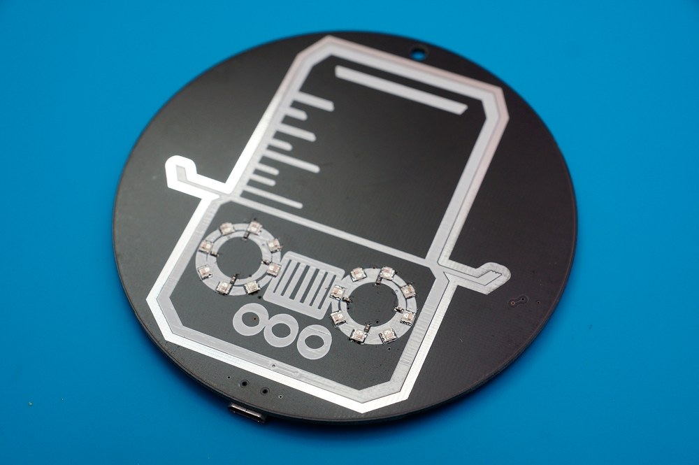
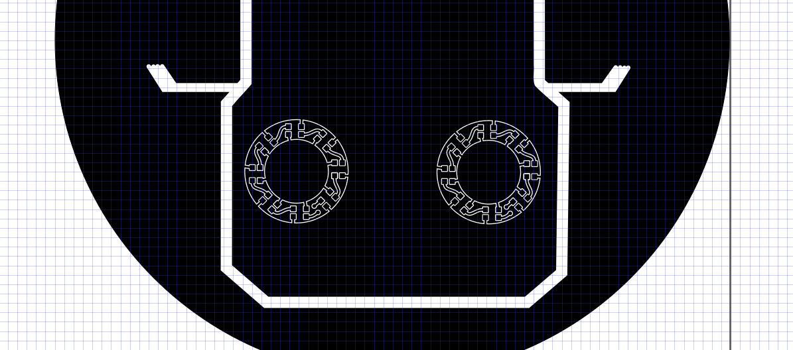
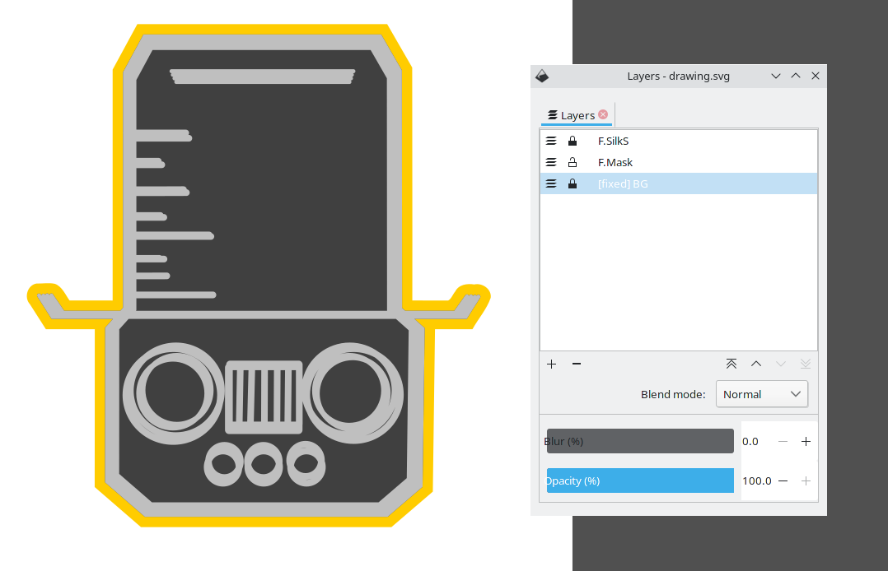
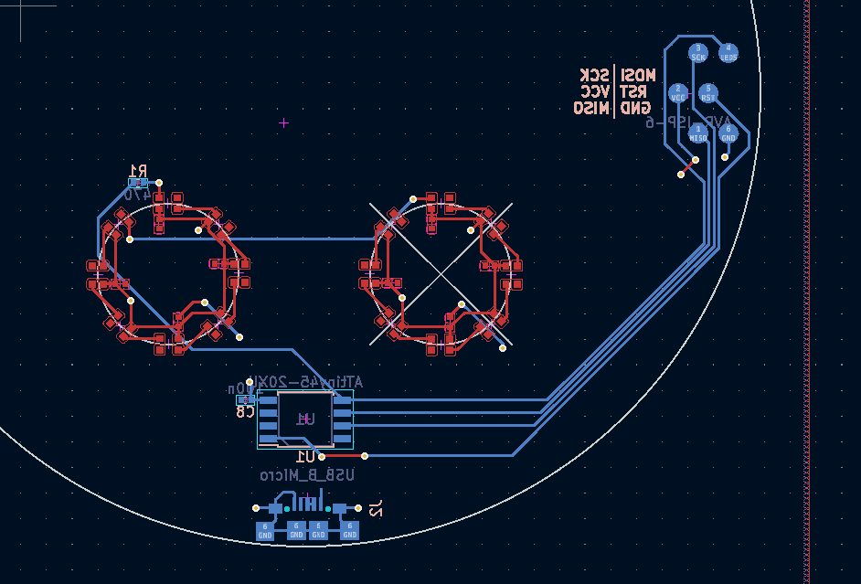
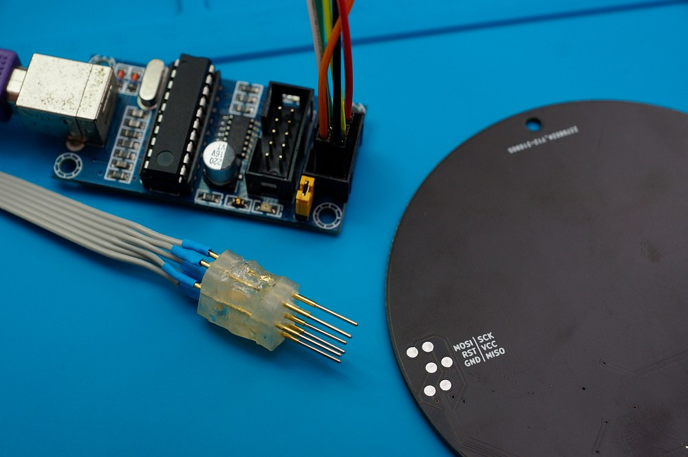
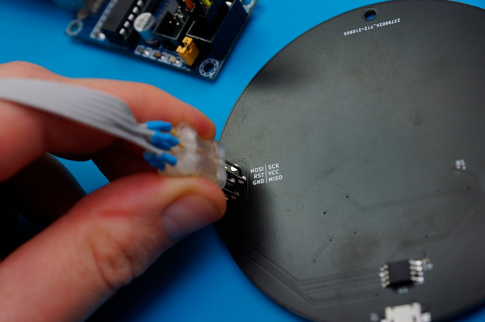

+++
title= "WS2812B PCB Art Badge"
+++

Turning an SVG logo into a custom and functional PCB with 16 RGB LEDs, an ATTiny45 MCU and USB power from an SVG logo.
<!-- more -->

A while ago I discovered the [svg2shenzhen](https://github.com/badgeek/svg2shenzhen) plugin for Inkscape. It allows you to draw components in Inkscape and then output them to a KiCAD component or project. I've been searching for a small project to try it out for a while and finally settled on a simple Hacker Badge-style PCB with the logo of the [Dachboden collective](https://www.youtube.com/watch?v=Y54qM3qJFXQ). I didn't just want a bare PCB, but also some functionality, and I do
have a strange addiction to projects involving WS2812B RGB LEDs. They are individually controllable, dirt-cheap and even though they have an obscure command protocol, they are well-supported on pretty much any micrcontroller out there, thanks to a large community of fans.

Without further ado, here's the result first:

<iframe width="560" height="315" src="https://www.youtube-nocookie.com/embed/7o16YRIi_9s" title="YouTube video player" frameborder="0" allow="accelerometer; autoplay; clipboard-write; encrypted-media; gyroscope; picture-in-picture" allowfullscreen></iframe>

Project schematics, PCB layout and code are available [on Github](https://github.com/jadeaffenjaeger/dachboden_badge)

## The Plan

I originally thought about making the outline of the logo the board outline but was afraid that the thin contour of the hat could break, bend or get stuck on things too easily. Instead I made the board a circle with the logo in the middle. I planned on having the board produced by [JLCPCB](www.jlcpcb.com) because of their absurdly low prices, which fixed the maximum size at 10cm x 10cm. My idea was to add LEDs around the eyes and have them do some colorful effects. Normal WS2812Bs come in a 5050 form factor, which would haven been way to clunky for the relatively fine details of the badge. Luckily, the WS2812B is also produced in a much smaller [2020 form factor](https://lcsc.com/product-detail/Light-Emitting-Diodes-LED_Worldsemi-WS2812B-2020_C965555.html) - just right to fit 8 of them around the eyes.

I thought about adding a LiPo battery for the badge to be self-contained but ultimately decided against it because:
- The LiPo itself would add quite a bit to the cost of each badge and I planned on making at least 10, so I was quite keen on keeping the cost low
- I was not sure how much and where they would really be used, so I wanted to keep the amount of electronics to a minimum, at least for the first run and see how it goes. I could always add a battery to later iterations if it was really needed.
- Since not everyone has a separate LiPo charger at home, I would have needed to add a charging circuit as well
- The WS2812B LEDs run on 5V, while a LiPo ranges from 4.2V to 3.3V, so a boost regulator to get to the proper voltage for the LEDs would have been needed as well
For a side project, I decided that this would drive up BOM cost and complexity too much, compared to the value it adds. I instead went with a much simpler solution: I added a micro-USB port on the backside of the badge. I assume almost everyone has at least a trillion micro-USB cables and a power bank at home. A power bank comes with all the regulators, charge and control circuitry needed and outputs a nice and clean 5V. In most cases, it will have to be carried separately, but I deemed
this acceptable considering the overall benefits.

For the MCU, I settled on an [Attiny45](https://ww1.microchip.com/downloads/en/DeviceDoc/Atmel-2586-AVR-8-bit-Microcontroller-ATtiny25-ATtiny45-ATtiny85_Datasheet.pdf) because it's relatively cheap, runs on 5V, requires almost no external components and has sufficient power to output a few patterns on 2812B LEDs. Also, I had [USBtinyISP](https://learn.adafruit.com/usbtinyisp) laying around and a complete Makefile at hand from using it in another project.

## Attempt No. 1: Routing in Inkscape
I initially tried to lay out the entire front side of the PCB by hand in Inkscape. I really liked the organic, rounded shapes of traces seen on [other PCB art badges](https://hackaday.com/2018/06/21/this-is-the-year-conference-badges-get-their-own-badges/) and wanted to go for a similar look. Unsurprisingly, even routing a relatively regular pattern in Inkscape turned out to be quite tedious. Nevertheless, after a while, I had something that I was quite happy with. Because the LEDs and capacitors on the front side were routed outside of KiCAD, I also could not add them to the Schematic and BOM and had to create a dummy schematic symbol that only had two connections for each eye.

After having the design manufactured, it turned out that there was a short between the GND and 5V rails, somewhere in the right eye. I never fully figured out where it came from, but I assume that I missed some clearance requirement during the manual routing. The first iteration also had a few other issues, namely that I messed up _both_ the footprint of the USB connector and the MCU (which is quite amazing, because besides the LEDs and a few SMD resistors and capacitors, those are the only components on the board...). The intricate, curved traces were also buried under the black soldermask and barely visible anyway, so for the second iteration, I decided to make my life a lot easier and do all routing inside of KiCAD. The 

## Attempt No. 2: Routing in KiCAD
In comparison, this was a breeze: I only exported the logo on the silk screen layer and the outline on the front copper layer from Inkscape and imported them as a symbol in KiCAD.

I then placed and routed the LEDs along with all other components in KiCAD. This meant that all my traces automatically had the proper clearance and got DRC-checked. In the first iteration, JLCPCB had put their lot number right on the front of the PCB which also didn't look great. For the second iteration, I found out that they offer an option to [place the number manually](https://support.jlcpcb.com/article/28-how-to-remove-order-number-from-your-pcb). Even though the article doesn't explicitly mention it, some googling revealed, that [you can even place it on the backside of the PCB](https://twitter.com/jlcpcb/status/1051760732323295233?lang=en), which worked just fine for me! 

## Programming
To be able to easily program the badge, the ISP connector is broken out as test points on the backside of the PCB. For the initial development, I simply soldered a flat cable onto these points for a permanent connection.

For quickly programming several badges, I 3d-printed two spacers that hold 6 pogo pins apart at the correct distances and glued the whole thing together using hot glue.

## Firmware

The firmware is fairly simple: Mainly just a few functions that draw different patterns using hard-coded timing values. To control the WS2812B LEDs, I use the [light_ws2812 library](https://github.com/cpldcpu/light_ws2812) which is minimal enough to work on the attiny45. For some randomness, an [LFSR](https://en.wikipedia.org/wiki/Linear-feedback_shift_register) is used.
